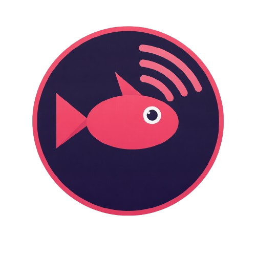

The presentation menu includes **Mailbox (low latency)**, a tear-free option that never waits for vblank and never queues frames on the GPU. See [docs/AUDIT-AND-LATENCY.md](docs/AUDIT-AND-LATENCY.md) and [docs/LATENCY-UPDATE.md](docs/LATENCY-UPDATE.md).

New: **MJPEG artifact reduction** (Esc > Video), a quantization-aware GPU filter for blocking, ringing and mosquito noise. See [docs/ARTIFACT-REDUCTION.md](docs/ARTIFACT-REDUCTION.md).

This edition includes the capture fallback fix, latest-frame selection after display acquisition, and a Mailbox/Immediate presentation menu. See [docs/LATENCY-UPDATE.md](docs/LATENCY-UPDATE.md).

# TackleCast

> Experimental source fork: adds **Request Super Resolution (NVIDIA RTX)** to the Video settings. The option defaults to off. Windows compilation and NVIDIA hardware validation are still required; no tested executable is included. See [build, usage and validation notes](docs/RTX-SUPER-RESOLUTION.md).

<p align="center">
  
</p>

**A lightweight, GPU-accelerated capture card viewer for Windows.** No recording, no bloat, just your game on your screen.

Built for capture cards like the Genki ShadowCast, Elgato, AVerMedia, and other UVC-compliant devices. Written in Rust with a zero-copy GPU pipeline for minimal latency.

## Features

- **GPU-accelerated rendering** via wgpu with a custom YUV-to-RGB shader
- **NVIDIA GPU MJPEG decode** via nvJPEG/CUDA (automatic fallback to software decode)
- **Zero-copy GPU pipeline** - decoded frames never leave the GPU (CUDA to DX12 to wgpu)
- **Low-latency audio passthrough** via WASAPI
- **Resolution options** - 720p, 1080p, 1440p, 4K
- **FPS modes** - 30, 60, 120, or Custom (30-240)
- **Live FPS counter** with real measured framerate
- **Auto-detect capture cards** via DirectShow
- **Dark theme UI** with pause-style settings menu (egui)
- **Fullscreen support** (F11 or toggle in settings)
- **Zero recording overhead** - purely a viewer
- **Settings persistence** - remembers your device selections
- **Diagnostic logging** - rotating log files for troubleshooting

## Quick Start

1. Download the latest release zip from [Releases](../../releases)
2. Extract anywhere
3. Double-click `TackleCast.exe`

No additional software required.

## Building from Source

See [BUILD.md](BUILD.md) for full build instructions.

```bash
cargo build --release
```

## Controls

| Action | Key |
|---|---|
| Open/close settings | Escape |
| Fullscreen | F11 |

## How It Works

TackleCast has a three-tier decode pipeline that automatically selects the best path for your hardware:

| Tier | Path | When |
|---|---|---|
| Zero-copy | nvJPEG decode to shared DX12 buffer to wgpu | NVIDIA GPU with CUDA support |
| GPU decode + readback | nvJPEG decode to host memory to wgpu | CUDA available, DX12 interop unavailable |
| Software decode | ffmpeg CPU decode to wgpu | No CUDA/nvJPEG available |

At 60 FPS and below, most capture cards output raw NV12 with zero decode overhead. Above 60 FPS, MJPEG is used and benefits from GPU decode.

## Architecture

```
src/
  main.rs          - winit event loop, app state, settings
  capture.rs       - DirectShow capture via ffmpeg-next, format/resolution fallback
  gpu_decode.rs    - NVIDIA nvJPEG GPU MJPEG decode (feature-gated: gpu-decode)
  dx12_interop.rs  - DX12 shared buffers for CUDA/wgpu zero-copy (feature-gated: gpu-decode)
  render.rs        - wgpu DX12 renderer, YUV->RGB WGSL shader
  audio.rs         - WASAPI audio passthrough via cpal
  ui.rs            - egui overlay and settings menu
  devices.rs       - DirectShow video + WASAPI audio device enumeration
  settings.rs      - JSON settings load/save
  logger.rs        - Rotating file logger via tracing
```

## Known Limitations

- **GPU decode is NVIDIA-only** (AMD AMF and Intel Quick Sync planned for a future release). Non-NVIDIA GPUs fall back to software decode automatically.
- **Windows only** (DirectShow capture, WASAPI audio, DX12 rendering).
- **Some capture cards may throttle at high framerates.** Smaller USB passthrough dongles (e.g. Genki ShadowCast 2 Pro) can thermally throttle their internal MJPEG encoder at sustained 1440p@120fps, causing frame delivery to drop to ~60fps. This is a hardware limitation, not a software issue. Devices with better thermal design (e.g. ShadowCast 3) are unaffected.
- Laptop GPUs may thermal throttle at sustained 4K@60fps or 1440p@120fps (a cooling pad helps).
- Webcams may partially work but are not officially supported.

## Acknowledgments

- **[@NeverForgetful](https://www.youtube.com/@NeverForgetful)** - Testing and QA

## License

MIT
