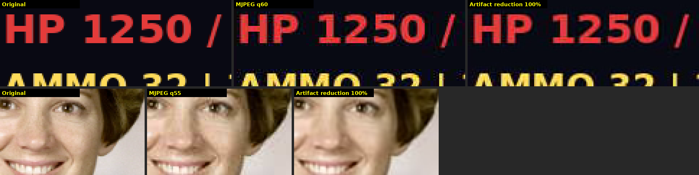

# MJPEG artifact reduction

**Esc → Video → MJPEG artifact reduction** (0–200%, default 100%, live preview). The line under the slider shows whether the filter is active and estimates the capture card's JPEG quality setting.

The filter runs only on MJPEG frames, which TackleCast uses for modes above 60 fps. NV12 capture isn't JPEG-compressed, so it is left untouched. Filtering happens at capture resolution, before display and before RTX Super Resolution, so VSR enhances the cleaned frame rather than the artifacts.

## How it works

MJPEG stores each 8×8 block as DCT coefficients rounded to multiples of the frame's quantization table. Blocking, ringing and mosquito noise are what that rounding leaves behind. The filter reads the quantization tables from every frame's JPEG header, so it knows how much each frequency could have been distorted. It then runs these steps on the GPU (`src/render/jpeg_cleanup.wgsl`):

1. **Shifted-DCT re-quantization.** For 8 grid offsets that don't line up with the encoder's blocks, it transforms each 8×8 block and drops coefficients smaller than half their quantization step. Real image detail lines up across grids; compression artifacts don't. The 8 results are averaged.
2. **Projection onto the received data.** The average is transformed on the encoder's own grid. Each coefficient is clamped to within 0.35 of a quantization step of the coefficient actually received. The output is therefore always close to an image that would have compressed to the same JPEG, and detail the stream carried is never removed.

The strength slider scales the step-1 threshold. A higher JPEG quality setting means smaller quantization steps, so the filter does less, and on a near-lossless stream it does almost nothing.

This is not a neural network. It is a deterministic, quantization-aware filter. It needs no model files or vendor runtime, works at any resolution (including 1440p) and on any GPU, and gives the same output for the same input, so a still image can't flicker. NVIDIA Maxine Artifact Reduction was considered and rejected: its input is limited to 1080p, it is tuned for H.264, and it needs a separate NVIDIA runtime installed.

## Measured quality

Test set: 8 images (photos, microscopy, astronomy and a synthetic game HUD), encoded as libjpeg 4:2:2 at qualities 40–97. Results are the average PSNR change against the uncompressed original at 100% strength.

| JPEG quality | 40 | 60 | 75 | 85 | 92 | 97 |
|---|---|---|---|---|---|---|
| Luma (dB) | +0.77 | +0.77 | +0.82 | +0.90 | +0.43 | +0.06 |
| Chroma (dB) | +0.98 | +0.87 | +0.87 | +0.89 | +0.89 | +0.74 |

The game-HUD image gained the most (up to +1.5 dB luma). The worst single case was a near-lossless frame (quality 92, mean squared error under 1 grey level), which lost 0.7 dB: a few single-pixel details were softened by a few levels, which isn't visible in practice. Use a lower strength if fine detail matters more than noise. The filter can't undo chroma subsampling: colour fringing on saturated text comes from 4:2:2, not from JPEG quantization.

## Cost

The filter adds one compute pass per plane, every captured frame, with about 9 dispatches and a copy per plane. That work is roughly 300 multiply-adds per pixel, plus about 64 bytes of memory traffic per pixel through an accumulation buffer. At 1440p120 this is an estimated 0.5–1 ms of GPU time per frame, and it adds that much latency. It has **not been measured on an NVIDIA GPU**. Set the slider to 0% to remove the work completely.

## Validation

- The GPU implementation was run on lavapipe (software Vulkan) and matches a NumPy reference implementation to within ±1 grey level of float rounding.
- The quality estimate matched the encoder's setting exactly at 50, 75 and 90.
- Portable tests cover the quantization-table parser (zigzag order, per-component table selection, 16-bit tables, truncated input), the shader's validity and its uniform layout.
- The Windows build type-checks. It has not been run on a capture card.
